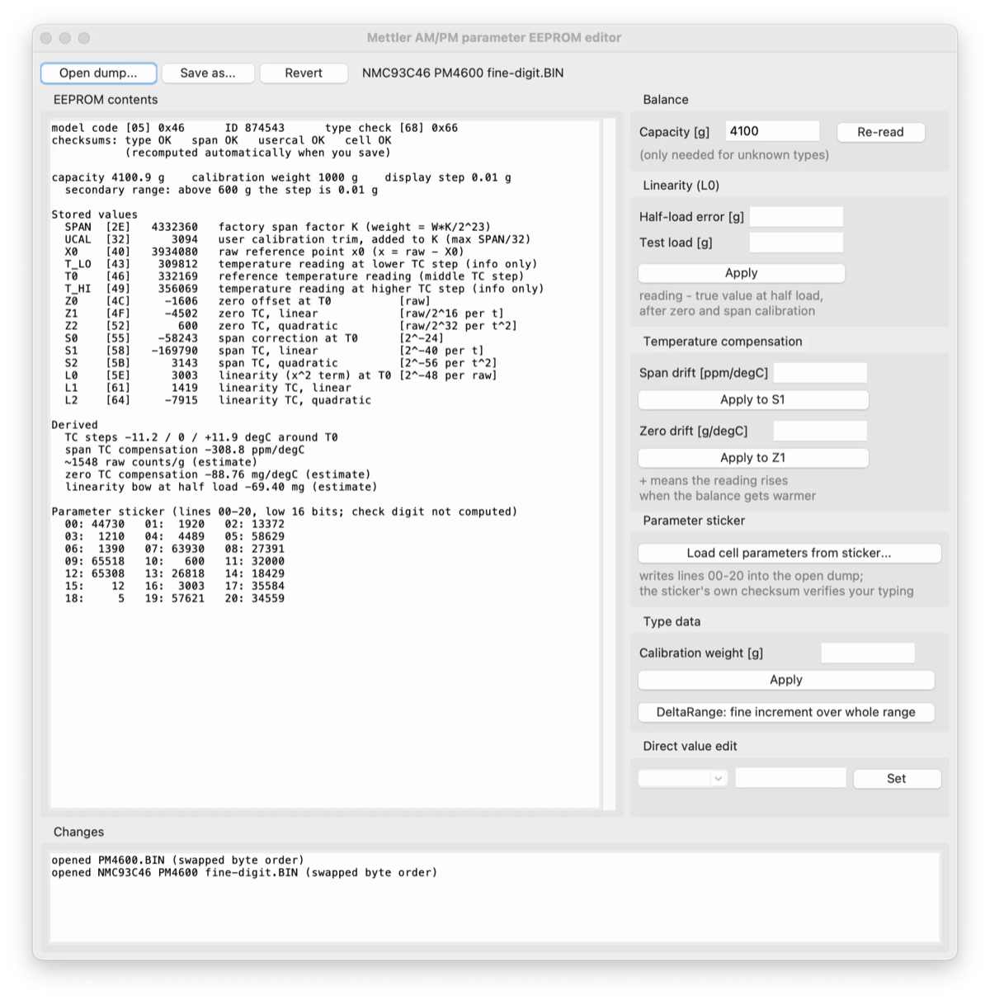

# Mettler AM/PM parameter EEPROM tool

Read, decode and edit the parameter EEPROM (NMC93C46) of Mettler-Toledo **AM/PM/CM/J series**
precision balances - the M-series instruments of the early 1990s, running the V10.xx "Standard"
program cassette.

These balances keep their measuring-cell parameters - span, linearity, temperature compensation,
balance type and the user calibration trim - in a 128-byte serial EEPROM on the main board. The same
numbers are printed on the parameter sticker inside the cover plate. Normally they can only be written
with a Mettler **ServicePac** adjustment cassette, which is almost impossible to find today. This tool
lets you decode that EEPROM, change the parameters and write it back with correct checksums, using
nothing more than an EEPROM programmer.

Everything here was reverse-engineered from the V10.45 cassette firmware and verified against four
balances (PM200, PM3000, PM4600, PM6000) and their stickers. **The tool only ever touches the EEPROM;
it does not modify balance firmware.**

**[EEPROM_MAP.md](EEPROM_MAP.md) documents the EEPROM itself** - the memory map, the checksums, the
byte order, the weighing formula and the meaning of every stored value. Read that if you want to
understand your dump rather than just edit it.

> **Working on a balance is your responsibility.** These are measuring instruments. Save your original
> dump before writing anything, and keep it. If your instrument is legal-for-trade or otherwise certified,
> changing these parameters invalidates its verification - don't do it unless you are entitled to.

## What it can do

- **Decode a dump**: balance type, ID, all four checksums, span factor, user calibration trim and the
  thirteen cell parameters, plus derived figures - compensated temperature coefficients, the built-in
  linearity correction, and the 21 lines as they appear on the parameter sticker.
- **Restore the cell parameters from the parameter sticker** - useful after a board swap or a corrupted
  EEPROM, and verified to reproduce the original dumps bit for bit.
- **Correct linearity** from a measured half-load error.
- **Correct temperature compensation**, span drift and zero drift, from drift you measured.
- **Change the stored calibration weight** (e.g. from 1 kg to 2 kg or 4 kg).
- **DeltaRange models**: display the fine increment over the whole weighing range instead of only in the
  fine range - on a PM4600 that means 10 mg up to 4100 g, which is the PM4000 specification.
- **Recompute the checksums** of a dump you edited by other means.

Every write recomputes all four block checksums and keeps the byte order of the file you opened.

## Example dumps

[`examples/`](examples/) holds the four factory EEPROMs this work was based on - PM200, PM3000, PM4600
and PM6000 - together with the numbers printed on their parameter stickers. Use them as reference data,
or as the template when programming a blank EEPROM for the same model.

## Requirements

Python 3.8 or newer. No third-party packages - the GUI uses tkinter from the standard library.
(On some Linux distributions tkinter is a separate package, e.g. `apt install python3-tk`.)

## Reading and writing the chip

The EEPROM is a 93C46 in 16-bit mode (64 words, 128 bytes), on the balance/scale board. Any programmer
that handles the 93C46 family will do; read it twice and compare before you change anything.

**Byte order**: the balance's processor shifts each 16-bit word out MSB first, but many programmers save
the file with the two bytes of each word swapped. The tool detects which order your file uses - by
checking the four checksums and the type byte - and always writes back in the same order it read, so the
file stays compatible with your programmer.

A dump must be exactly 128 bytes. If the tool reports bad checksums on a fresh read, the dump is
unreliable (bad contact, wrong device) - fix that before going further.

## The GUI

```bash
python3 tools/pm_eeprom_gui.py            # or drop a dump on it: ... gui.py mydump.BIN
```



Open a dump, and the left pane shows everything the balance stores. The right-hand panels apply the
corrections; each one writes a line into the change log so you can see exactly what moved. Nothing is
written to disk until you press *Save as...*, and *Revert* takes you back to the file as opened.

For an unknown balance type, type the nominal capacity in grams into the Balance box - the tool needs it
to convert between grams and internal counts.

## The command line

```bash
python3 tools/pm_eeprom.py info    dump.BIN
python3 tools/pm_eeprom.py lin     in.BIN out.BIN --half-error -0.020 --load 4000
python3 tools/pm_eeprom.py tcspan  in.BIN out.BIN --ppm-per-c 5
python3 tools/pm_eeprom.py tczero  in.BIN out.BIN --g-per-c 0.001
python3 tools/pm_eeprom.py calweight in.BIN out.BIN --grams 2000
python3 tools/pm_eeprom.py fine    in.BIN out.BIN
python3 tools/pm_eeprom.py set     in.BIN out.BIN L0=2253 S1=-182000
python3 tools/pm_eeprom.py sticker in.BIN out.BIN 44730 984960 ... (21 values)
python3 tools/pm_eeprom.py fix     in.BIN out.BIN
```

`--capacity <g>` tells the tool the nominal capacity when the balance type isn't in its table;
`--raw-per-g <n>` overrides the estimated gram-to-count scale (see *Accuracy of the estimates*).

## How the balance uses these numbers

With `t` the temperature reading relative to the stored reference `T0`, and `x` the raw signal relative
to the reference point `X0`:

```
W      = raw + Z(t) + S(t)*x/2^24 + L(t)*x^2/2^48
weight = W * (SPAN + UCAL) / 2^23
```

`Z`, `S` and `L` - zero, span and linearity - are each a quadratic in temperature, which is why there are
nine coefficients plus the three reference temperatures. So **L0 is the linearity term** and **S1 is the
span temperature coefficient**. [EEPROM_MAP.md](EEPROM_MAP.md) has the full memory map, the checksum
algorithm, the sticker format and the firmware addresses everything was taken from.

## Procedures

**Linearity.** Calibrate, then measure the error at half load. The most reliable way is to use one weight
throughout: load it, note the reading, tare, add ballast, load the same weight again, and so on across the
range - the weight's own error then cancels, and the running sum of the deviations is the linearity curve.
Feed the half-load deviation to `lin` with the full test load, program, recalibrate, and re-check at 1/4,
1/2 and 3/4 load. The tolerance for your model is in the service manual.

**Programming a blank or replaced EEPROM.** The sticker holds the cell parameters only - span factor,
balance type, units and configuration are not on it. So start from a dump of a balance **of the same
model** as a template, use *Load cell parameters from sticker...* to type in the 21 numbers, and save.
The sticker's own checksum verifies your typing: get one digit wrong and the tool tells you before the
chip is ever written. This mirrors the factory procedure, where the type cassette loads the type data and
the adjustment cassette takes the cell parameters from the sticker; calibrate the balance afterwards and
the user trim absorbs the remaining unit-to-unit difference.

**Span temperature coefficient.** Read the full load at two stable temperatures hours apart, compute
ppm/degC, apply with `tcspan`. This one does not depend on the gram-to-count scale, and it leaves the
reading at the reference temperature unchanged, so no recalibration is needed. Let the balance reach
thermal equilibrium with the housing closed - the compensation assumes the cell and the temperature
sensor are at the same temperature, so a gradient looks exactly like a linearity error.

**Zero temperature coefficient.** Same idea with the zero reading, applied with `tczero`.

## Accuracy of the estimates

Gram-to-count conversion is derived from the type data, not measured. A cross-check over the four
reference balances gives 6.30 / 4.79 / 6.35 / 6.38 million raw counts at capacity for the PM200 / PM3000 /
PM4600 / PM6000 - essentially the same full-scale span for all four cells, which is reassuring but not a
calibration. Treat the first correction as a trial: if the error moves by a different amount than
predicted, scale the next step by the ratio, or pass the corrected scale with `--raw-per-g`.

The temperature scale of 2000 counts per degC comes from a worked example in the service manual.

## What is known and what isn't

Verified against four balances: all four checksums, the complete sticker encoding (rebuilding the cell
block from a sticker reproduces the original dump byte for byte), the type data encoding, and the
weighing formula as traced in the firmware.

Not solved: the **check digit** in the printed sticker numbers. Each printed value is 20 bits - a 4-bit
check digit plus the 16-bit EEPROM word - and the standard firmware never computes it, so the tool reads
stickers but cannot print a complete new one. If you have a dump plus its sticker for a model not listed
here, that's exactly the data needed to crack it; please open an issue.

Everything was derived from V10.45. Other V10.xx versions very probably use the same layout; that has not
been tested.

## Contributing

Dumps paired with photographs of the matching parameter sticker are the most useful contribution,
especially for models outside the four already analysed. Reports of what worked - or didn't - on a real
balance are equally welcome.

This repository contains no Mettler-Toledo firmware, software or documentation. The service manual and the
program cassette contents are Mettler-Toledo's copyright; please don't add them here.

## Licence

MIT - see [LICENSE](LICENSE). Not affiliated with, endorsed by, or supported by Mettler-Toledo.
"METTLER", "Mettler-Toledo", "DeltaRange" and "ServicePac" are their trademarks, used here only to
describe the equipment this tool works with.
